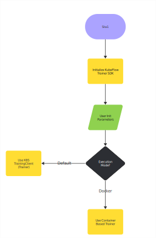
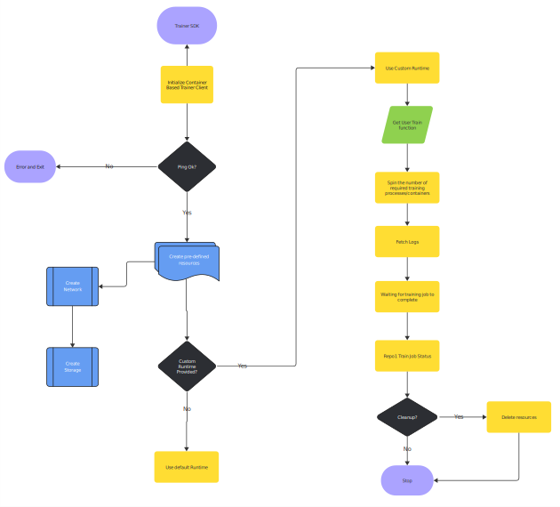

# KEP-2: Trainer Local Execution

## Summary

This KEP proposes the introduction of a local execution mode for the Kubeflow Trainer SDK, allowing machine learning (ML) engineers to test and experiment with their models locally before submitting them to a kubernetes based infrastructure. The feature will enable ML engineers to use Subprocess, Docker or other container runtimes to create isolated environments for training jobs, reducing the cost and time spent running experiments on expensive cloud resources. This local execution mode will allow for rapid prototyping, debugging, and validation of training jobs.

## Motivation

Currently, Kubeflow’s Trainer SDK requires jobs to be executed on a Kubernetes cluster. This setup can incur significant costs and time delays, especially for model experiments that are in the early stages. ML engineers often want to experiment locally before scaling their models to a full cloud-based infrastructure. The proposed local execution mode will allow engineers to quickly test their models in isolated containers or virtualenvs via subprocess, facilitating a faster and more efficient workflow.

### Goals
- Allow users to run training jobs on their local machines using container runtimes or subprocess.
- Implement a Local Trainer Client that integrates seamlessly with the Kubeflow SDK, supporting both single-node and multi-node training processes.
- Provide an implementation that supports PyTorch, with the potential to extend to other ML frameworks or runtimes.
- Ensure compatibility with existing Kubeflow Trainer SDK features and user interfaces.

### Non-Goals
- Full support for distributed training in the first phase of implementation.
- Support for all ML frameworks or runtime environments in the initial proof-of-concept.
- Major changes to the Kubeflow Trainer SDK architecture.

## Proposal

The local execution mode will allow users to run training jobs in container runtime environment on their local machines, mimicking the larger Kubeflow setup but without requiring Kubernetes. 

### User Stories (Optional)

#### Story 1
As an ML engineer, I want to run my model locally using Podman/Docker containers so that I can test my training job without incurring the costs of running a Kubernetes cluster.

#### Story 2
As an ML engineer, I want to initialize datasets and models within Podman/Docker containers, so that I can streamline my local training environment.

### Notes/Constraints/Caveats
- The local execution mode will initially support Podman, Docker, Apple Container and Subprocess.
- The subprocess implementation will be restricted to single node.
- The local execution mode will support only pytorch runtime initially.

### Risks and Mitigations
- **Risk**: Compatibility issues with non-Docker container runtimes.
  - **Mitigation**: Initially restrict support to Podman/Docker and evaluate alternatives for future phases.
- **Risk**: Potential conflicts between local and Kubernetes execution modes.
  - **Mitigation**: Ensure that the local trainer client is implemented with the exact same interface as the current TrainerClient to enable users to switch between both seamlessly.

## Design Details

The local execution mode will be implemented using a new `LocalTrainerClient`, which will allow users to execute training jobs using containers. The client will utilize container runtime capabilities to create isolated environments, including volumes and networks, to manage the training lifecycle. It will also allow for easy dataset and model initialization.

- **LocalTrainerClient** will expose an interface similar to the existing `TrainerClient`.
- The Podman/Docker client will connect to a local container environment, create shared volumes, and initialize datasets and models as needed.
- The **DockerJobClient** will manage Docker containers, networks, and volumes using runtime definitions specified by the user.
- The **PodmanJobClient** will manage Podman containers, networks, and volumes using runtime definitions specified by the user.
- Containers will be labeled with job IDs, making it possible to track job status and logs.
- An abstract interface to maintain API consistency across different clients or backends.

### Test Plan

- **Unit Tests**: Ensure that the `LocalTrainerClient` and `JobClient` have complete unit test coverage, especially for container management, dataset initialization, and job tracking.
- **E2E Tests**: Conduct end-to-end tests to validate the local execution mode, ensuring that jobs can be initialized, executed, and tracked correctly within Podman/Docker containers.

### Graduation Criteria
- The feature will move to the `beta` stage once it supports multi-node training with pytorch framework as default runtime and works seamlessly with local environments.
- Full support for multi-worker configurations and additional ML frameworks will be considered for the `stable` release.

## Implementation History
- **KEP Creation**: April 2025
- **Implementation Start**: April 2025
## Drawbacks

- The initial implementation will be limited to single-worker training jobs, which may restrict users who need multi-node support.
- The local execution mode will initially only support Podman/Docker and may require additional configurations for other container runtimes in the future.

## Alternatives
- **Full Kubernetes Execution**: Enable users to always run jobs on Kubernetes clusters, though this comes with higher costs and longer development cycles for ML engineers.
